# python

Laboratorio 1
Se inicia proyecto y se realiza el primer print con el Hola Mundo y mi nombre. 
Ejemplo de salida: 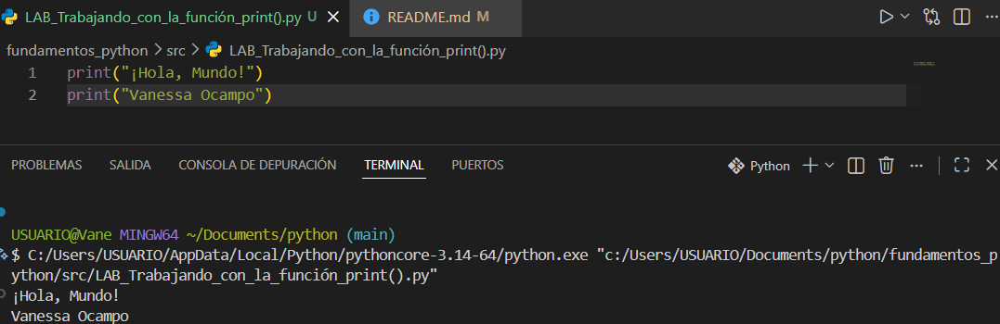
Al eliminar las comillas doble el sistema genera un error en la systansix 
Ejemplo de salida: 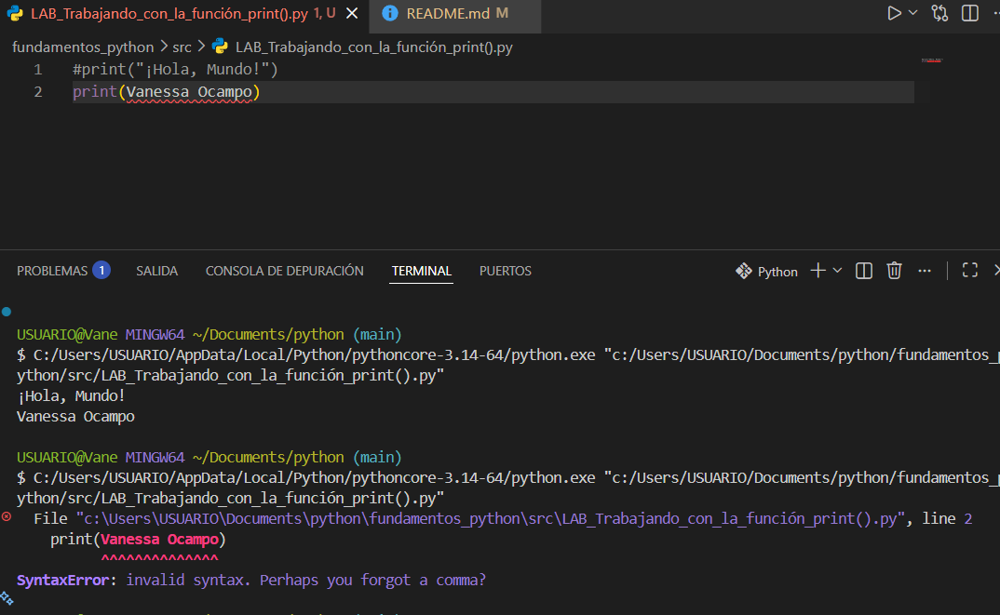
Al eliminar los parentesis y poner solo comillas dobles, tampoco permite avanzar y genera un error en la impresión de consola
Ejemplo de salida: 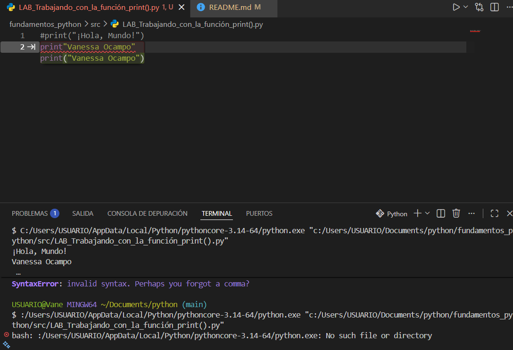
Al realizar varios intentos  y  no tener una buena sintaxis no es posible realizar la correcta impresión en consola de las mismas
Ejemplo de salida: 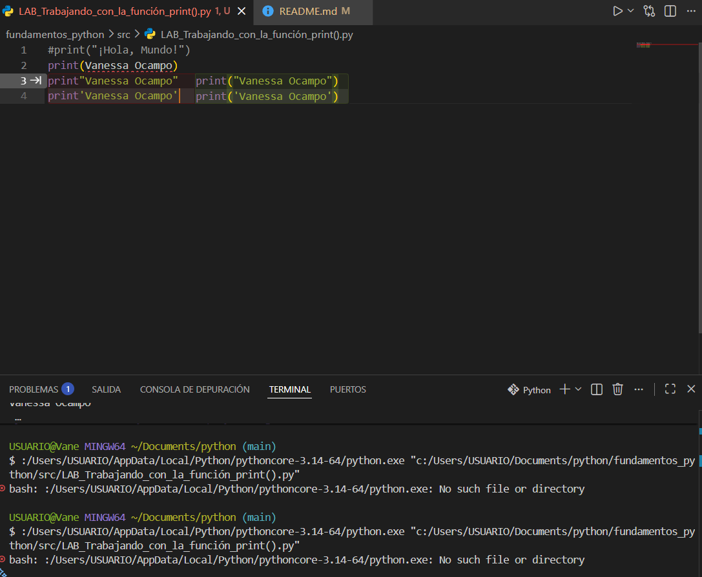

Laboratorio 2
Se realiza la solicitud de lo que solicita en la impresión de la consola,  la cual genero un poco de confusión por la separacióon que se debía hacer con la última palabra de python 
Ejemplo de salida: 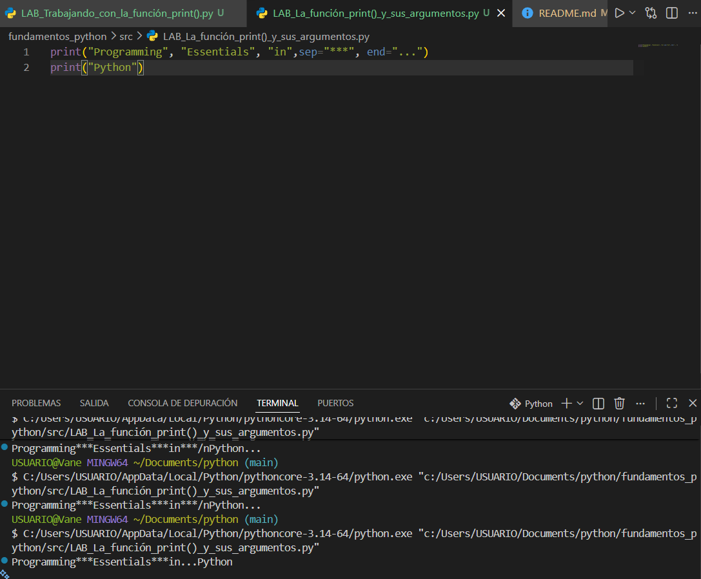

Laboratorio 3 
Se inicia con el código base del matrerial de aprendizaje
Ejemplo de salida: 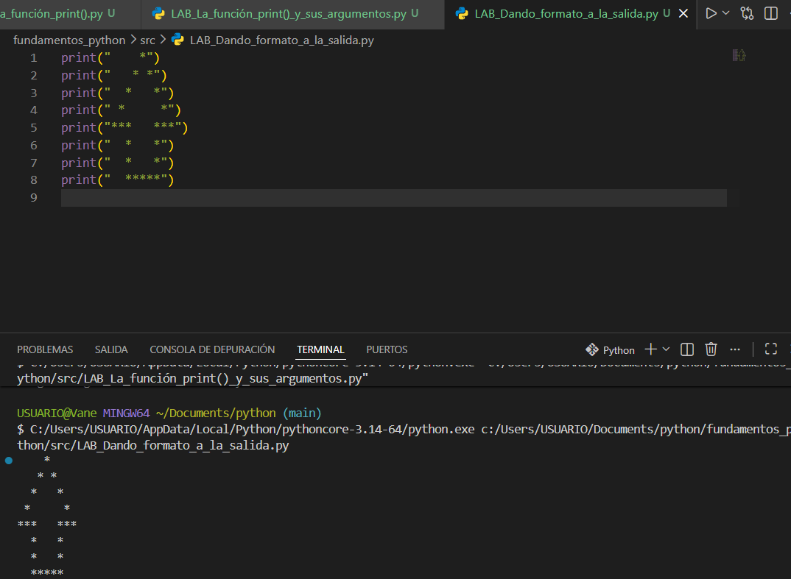

Se minimizan las líneas de código según la solicitud del laboratorio 
Ejemplo de salida: 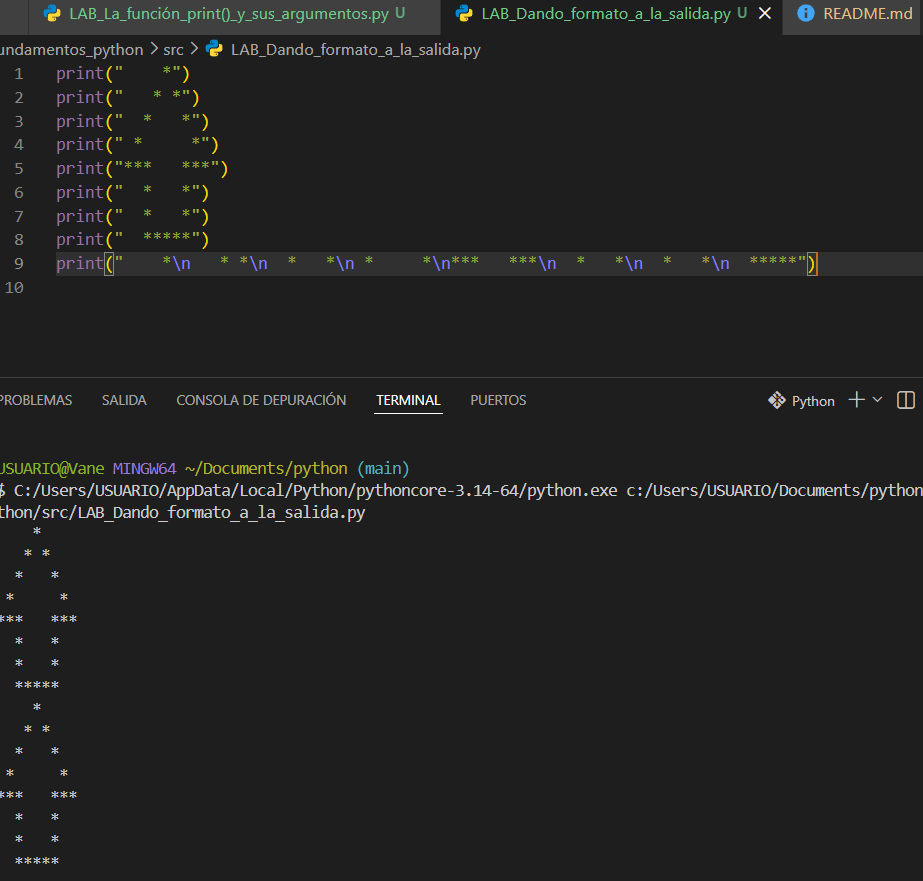

Se realiza el aumento de tamaño de la flecha al doble sin modificar sus proporciones 
Ejemplo de salida: 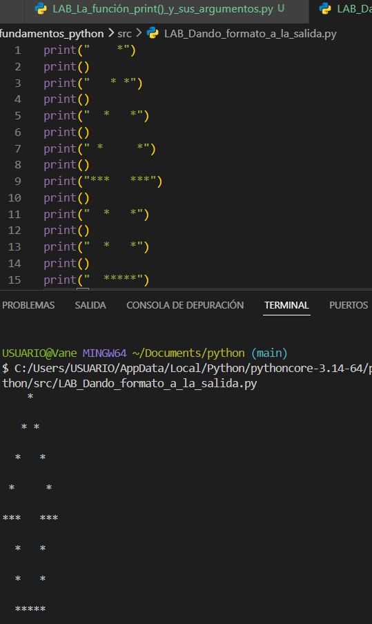

Se realiza el duplicado de la flecha sin utilizar el string, solo con espacios y saltos de línea  ya que  no permite el uso del string en el lenguaje 
Ejemplo de salida: 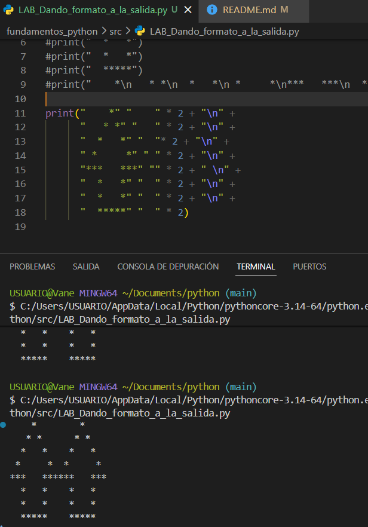

Se elimina una de las comillas dobles y se analiza lo sucedidoy el error que genera python, indicando la lína y lugar del error que se trata de " 
Ejemplo de salida: 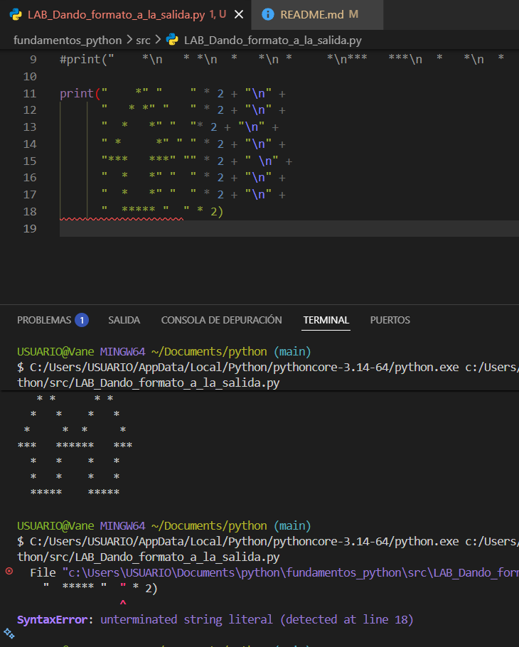

Se eliminan los parentesis y se analiza a detalle la función y errores que genera,indicando que los parentesis del print no  permiten la impresión en la consola. 
Ejemplo de salida: 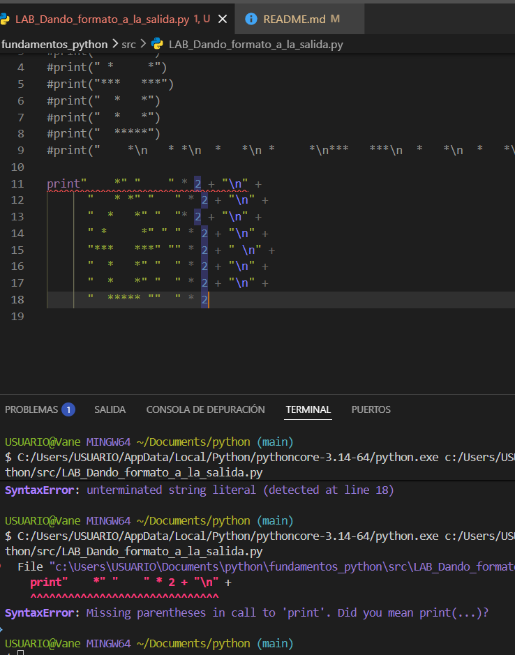

Se modifica la palabra Print por la P en mayúscula para verificar que pasa, el mismo sistema  genera error y no permite la impresión de esta en consola ya que no reconoce la palabra como lenguaje. 
Ejemplo de salida: 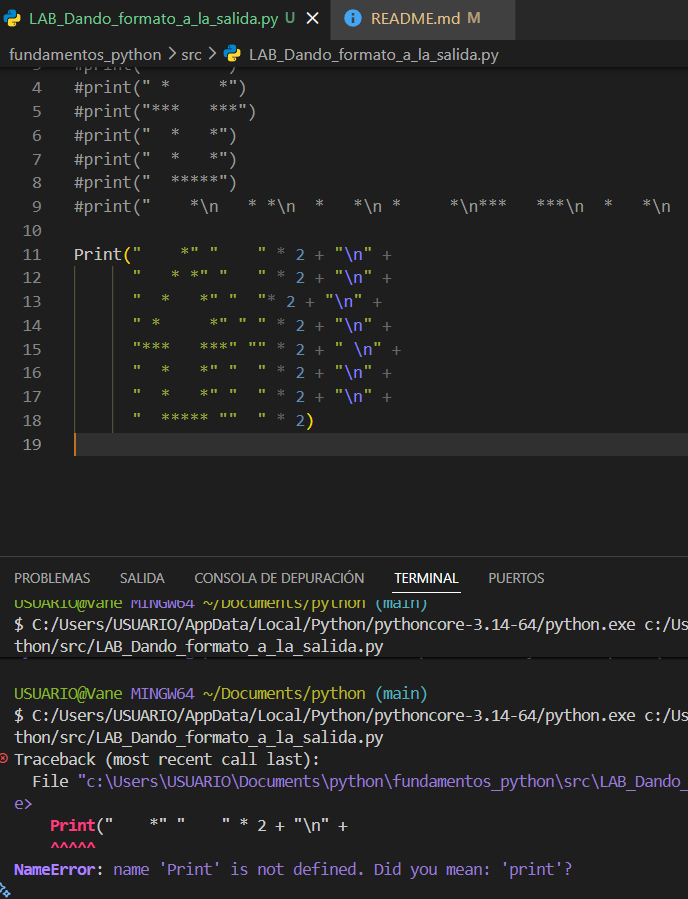

Al cambiar la comilla por un apostrofe o tilde, el sistema genera un error y nos muestra la línea e identifica el lugar donde se encuentra el error. 
Ejemplo de salida: 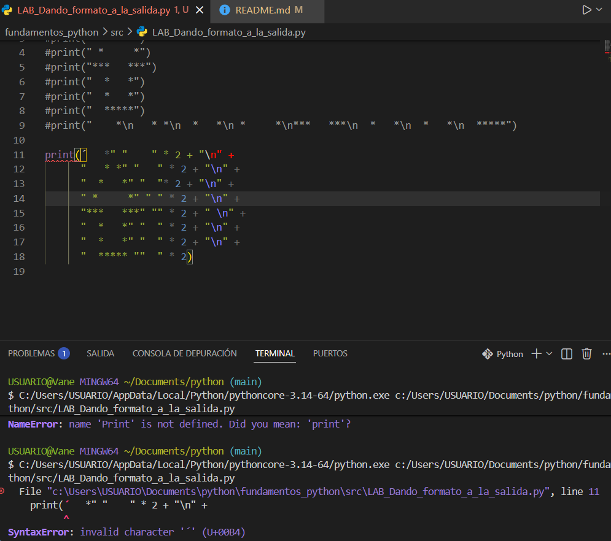