Ejercicio 1: 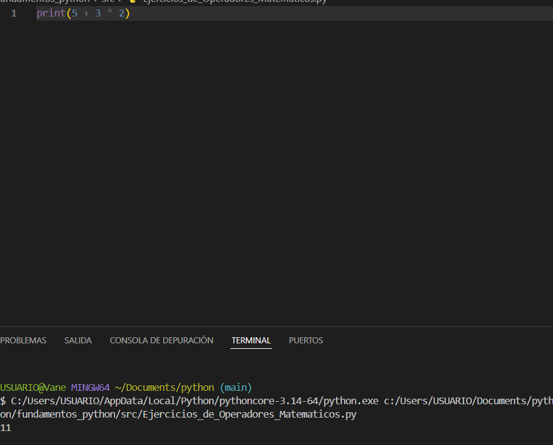
¿Cuál es el resultado? ¿Por qué?
Porque priorizamos * que es mayor que la suma entonces 3 * 2 = 6 y 5 + 6 = 11 el resultado es 11

Ejercicio 2: 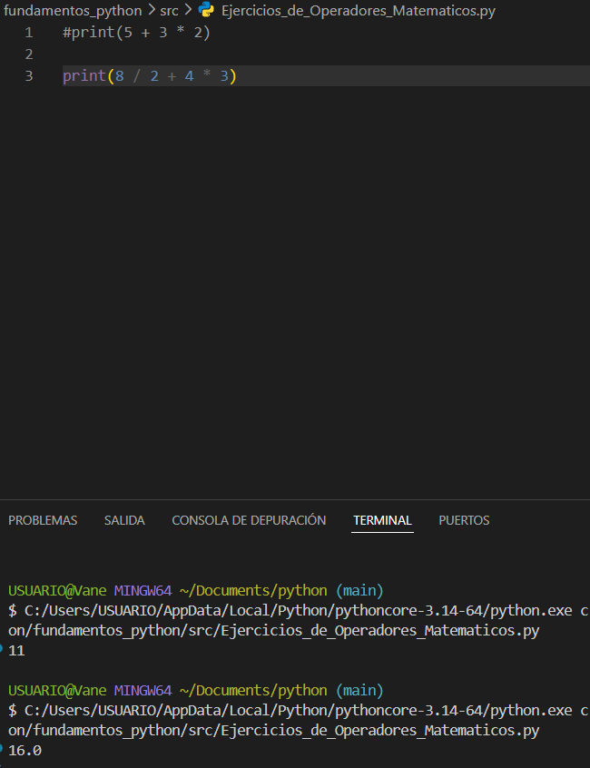
¿Cuál es el resultado? ¿Por qué?
/ Tiene la misma prioridad entonces iniciamos de izquierda a derecha, 4 * 3 = 12 8 / 2 = 4.0 por que estamos dividiendo en decimal 12 + 4.0 = 16.0 el resultado es 16.0

Ejercicio 3: 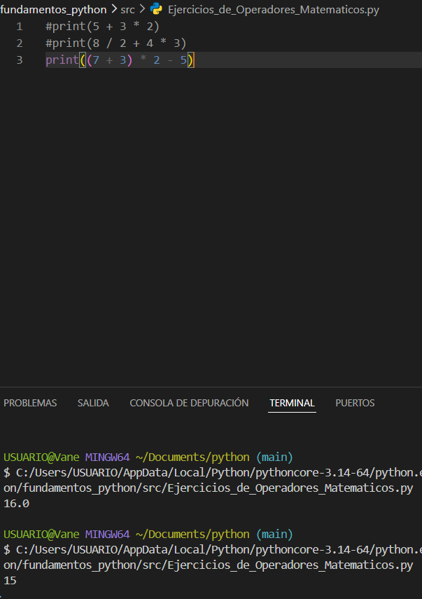
¿Cuál es el resultado? ¿Por qué?
priorizamos lo que hay en el parentesis, entonces (7 + 3) = 10 nos queda esta expresion 10 * 2 - 5 10 * 2 = 20 - 5 = 15

Ejercicio 4: 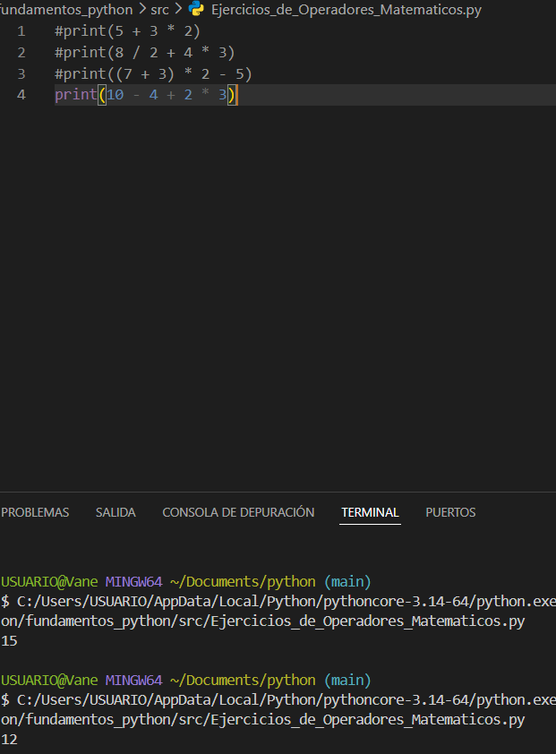
¿Cuál es el resultado? ¿Por qué?
Primero priorizamos el * y quedaría 2 * 4 = 6 nos queda esta expresion 10 - 4 + 6 y terminamos de izquierda a derecha 10 - 4 = 6 , entonces 6 + 6 = 12 resultado es 12

Ejercicio 5: 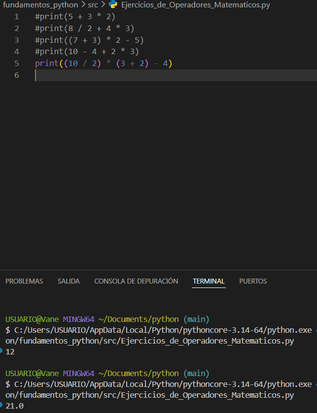
¿Cuál es el resultado? ¿Por qué?
Priorizamos parentesis (10 / 2) = 5.0 (3 + 2) = 5 nos quedaria esta expresion 5.0 * 5 - 4 entonces priorizamos * 5.0 * 5 = 25.0 entonces 25.0 - 4 = 21.0 resultado 21.0

Ejercicio 6: 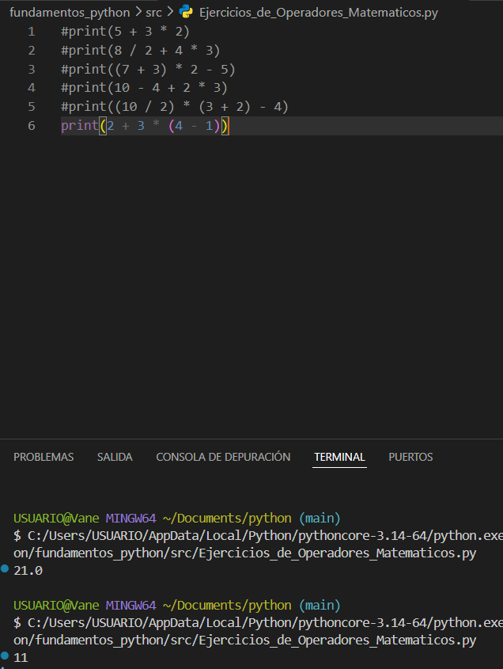
¿Cuál es el resultado? ¿Por qué?
Expresión: 2 + 3 * (4 - 1) primero parentesis (4 - 1) = 3 queda: 2 + 3 * 3 prioridad de operaciones x 3 * 3 = 9 nos queda 2 + 9 = 11 respuesta es 11

Ejercicio 7: 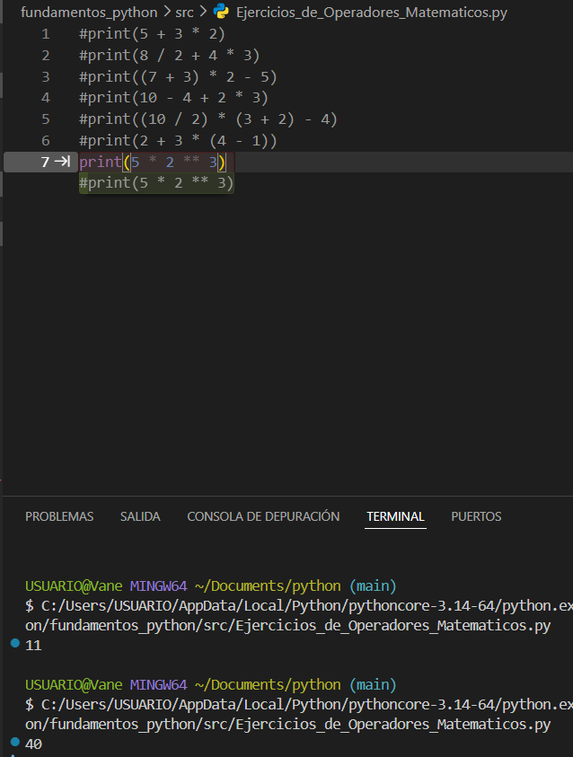
¿Cuál es el resultado? ¿Por qué?
Expresión: 5 * 2 * 3 priorida de operadodes * 2 ** 3 = 2 x 2 x 2 = 8 nos queda 5 * 8 = 40 respuesta 40

Ejercicio 8: 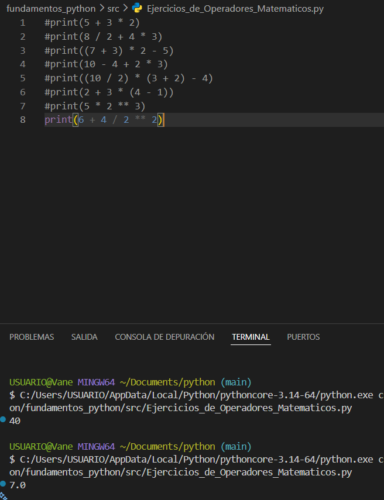
¿Cuál es el resultado? ¿Por qué?
Expresión: 6 + 4 / 2 ** 2 primero prioridad de operadores 2 ** 2 = 2 x 2 = 4 entonces 6 + 4 / 4 priorida de operadores / luego, 4 / 4 = 1.0 por que si divimos con este operador seria una suma de punto flotante entonces 6 + 1.0 = 7.0 respuesta es 7.0

Ejercicio 9: 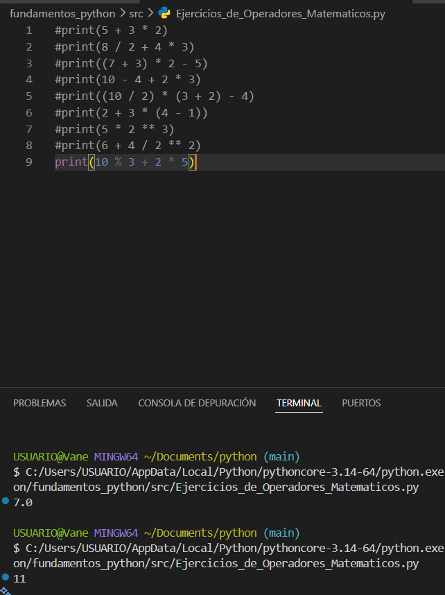
¿Cuál es el resultado? ¿Por qué?
Expresión: 10 % 3 + 2 * 5 prioridad de operadores 2 * 5 = 10 entonces 10 % 3 + 10 aqui seguimos con la prioridad de operadores y finalizamos con 10 % 3 = 1 1 + 10 = 11 respuesta es 11

Ejercicio 10: 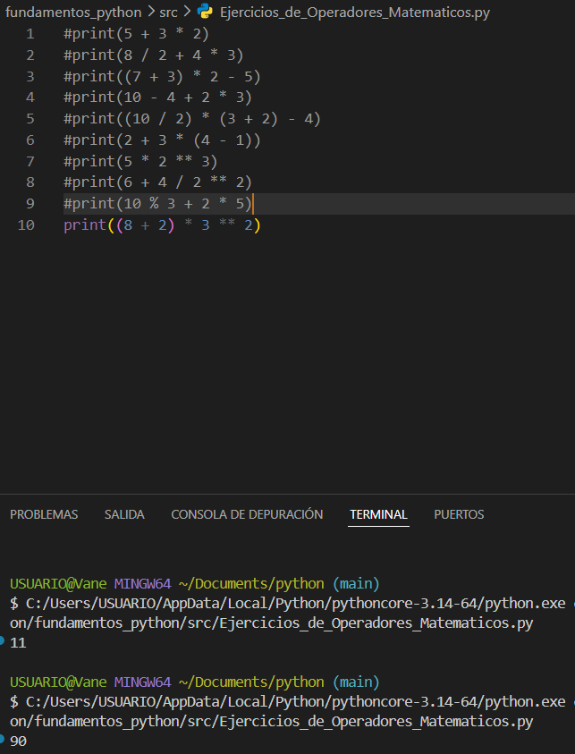
¿Cuál es el resultado? ¿Por qué?
Expresión: (8 + 2) * 3 ** 2
como siempre se priorizan parentesis a tes que los operadores
(8 + 2) = 10
10 * 3 ** 2
ahora priorizamos potencia
3 ** 2 = 9
10 * 9 = 90

Ejercicio 11: 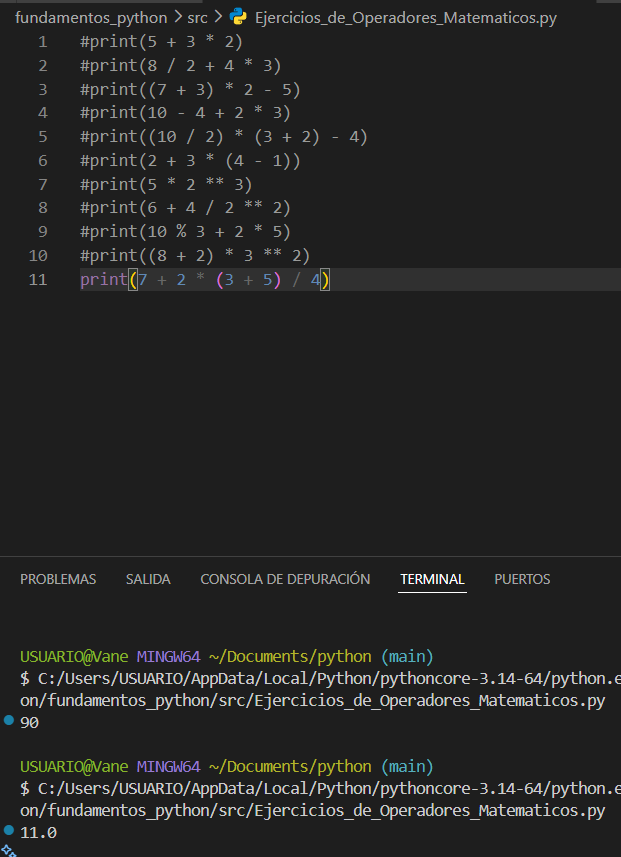
¿Cuál es el resultado? ¿Por qué?
Expresión: 7 + 2 * (3 + 5) / 4 resolvemos primero parentesis
(3 + 5) = 8 7 + 2 * 8 / 4 despues priorizamos operadores como * /
2 * 8 = 16 16 / 4 = 4.0 7 + 4.0 = 11.0 resulatdo es 11.0

Ejercicio 12: 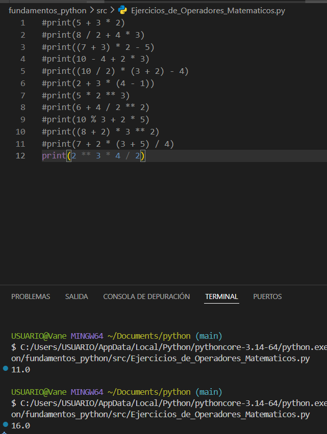
¿Cuál es el resultado? ¿Por qué?
resolvemos operadores 2 ** 3 = 8 luego 8 * 4 = 32 y por último 32 / 2 = 16.0 respuesta 16.0 por que el operador / siempre devuelve decimal

Ejercicio 13: 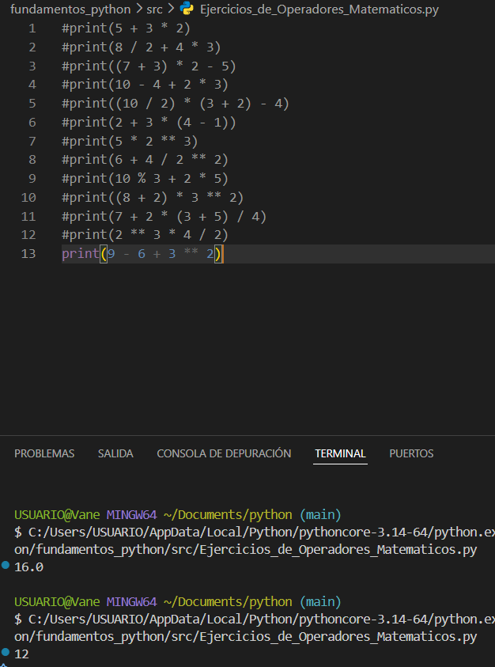
¿Cuál es el resultado? ¿Por qué?
resolvemos operadores 3 ** 2 = 9 resolvemos los demas operadores como son del mismo nivel resolvemos de izquierda a derecha nos queda 9 - 6 = 3 3 + 9 = 12

Ejercicio 14: 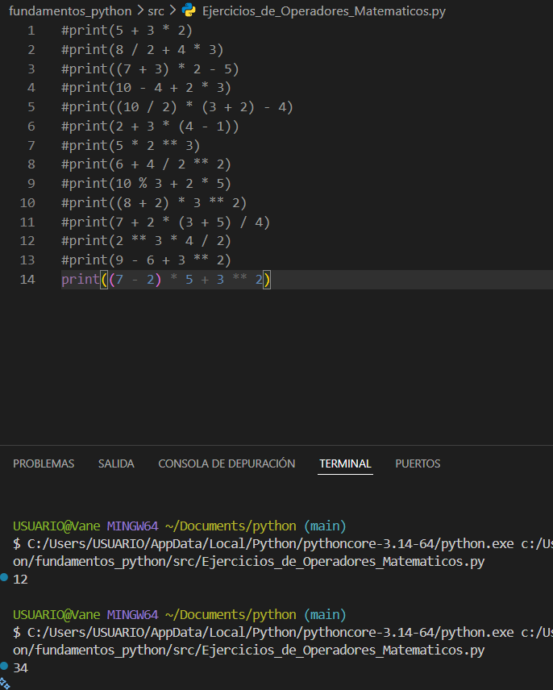
¿Cuál es el resultado? ¿Por qué?
primero parentesis (7 - 2) = 5 5 * 5 + 3 ** 2 ahora operedores como * 3 * 2 = 9 nos queda 5 * 5 + 9 5 * 5 = 25 25 + 9 = 34

Ejercicio 15: 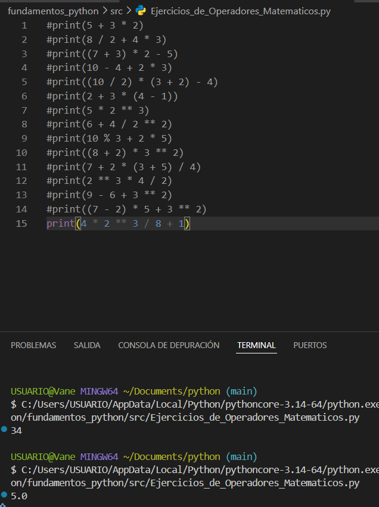
¿Cuál es el resultado? ¿Por qué?
primero los operadores principales 2 ** 3 = 8 4 * 8 / 8 + 1 los demas parentesis que falta 4 * 8 = 32 32 / 8 = 4.0 queda en decimal por su operador / 4.0 + 1 = 5.0